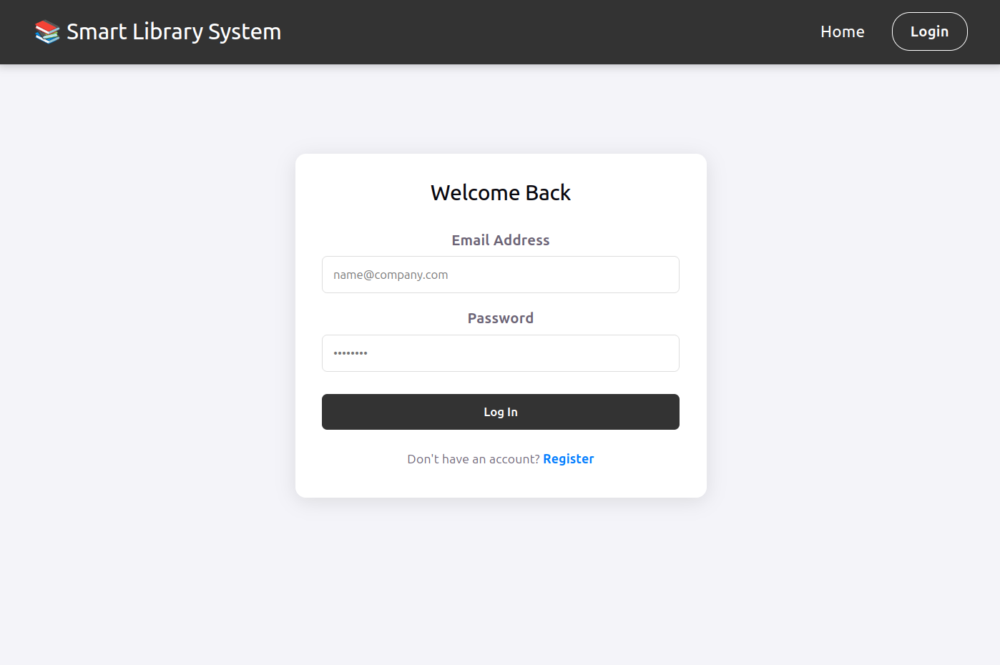
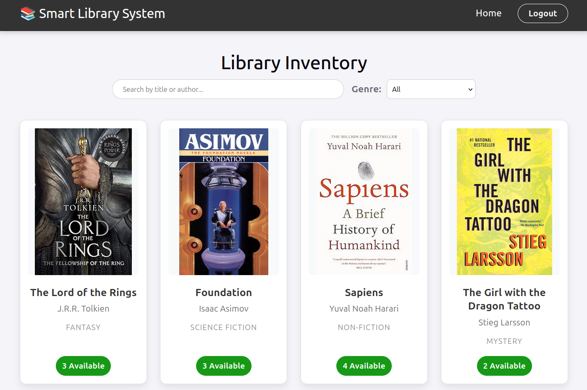
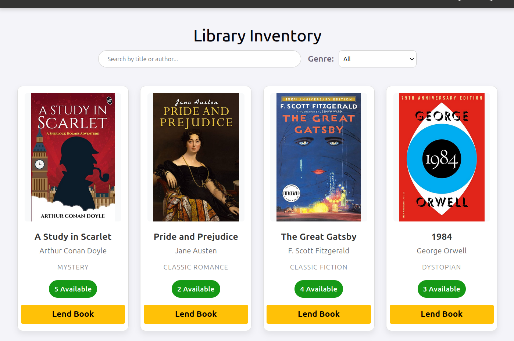
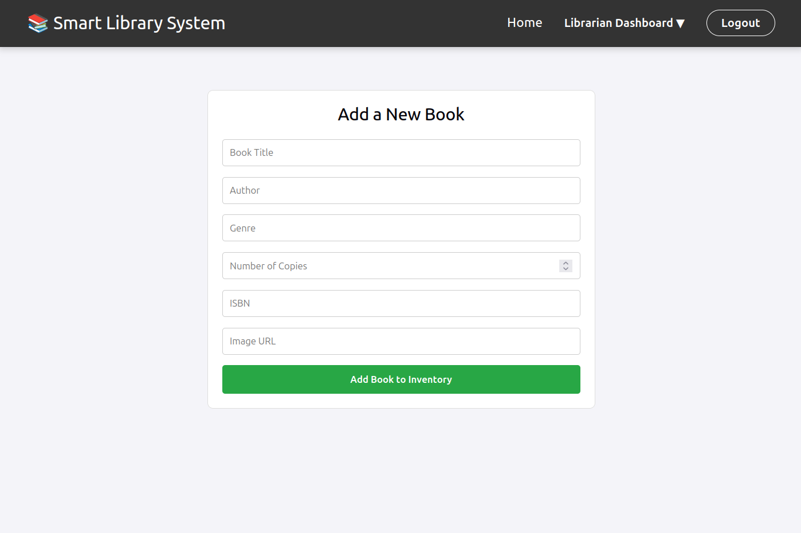
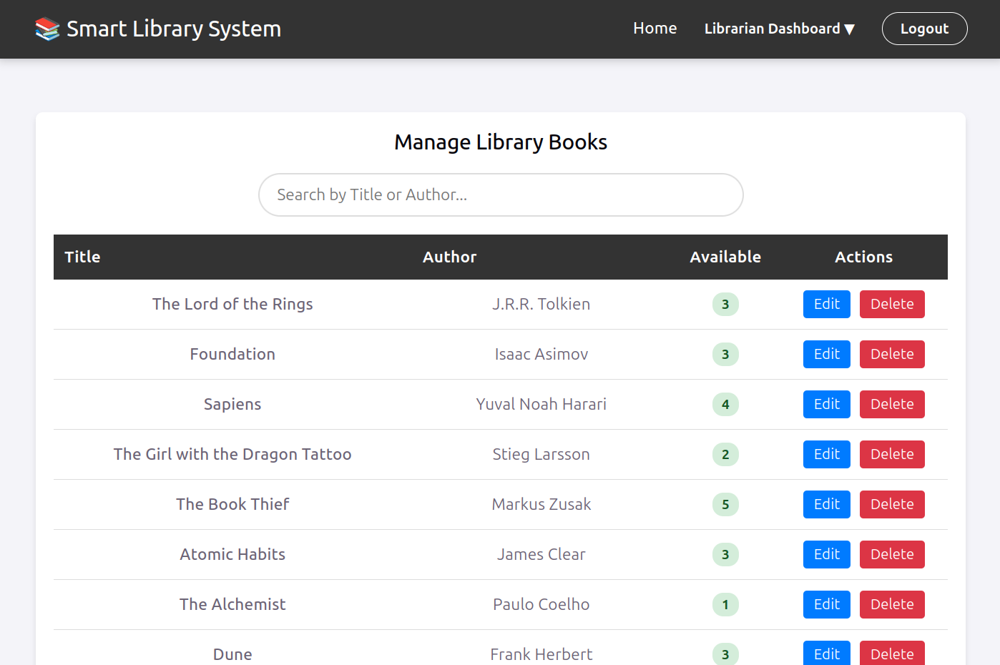
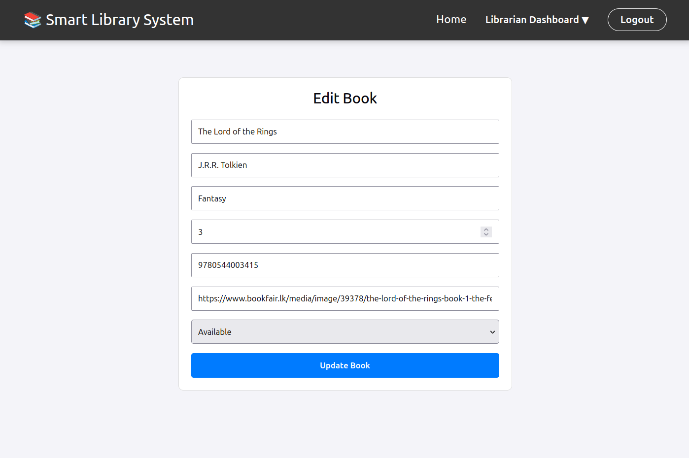
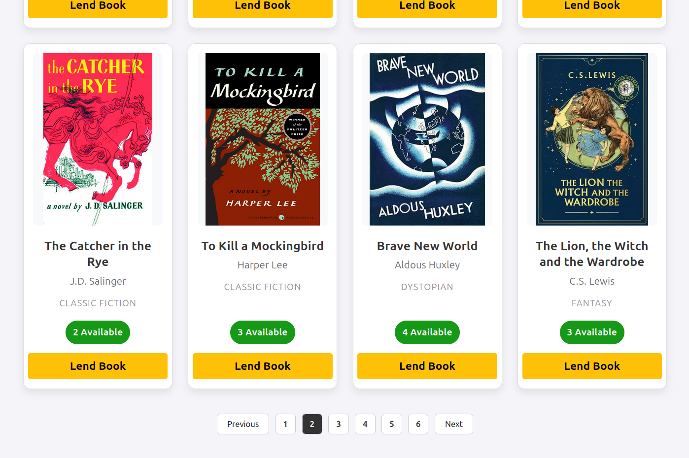

# 📚 Smart Library Management System


A full-stack, cloud-deployed Library Management System built with the MERN stack. This application digitizes library operations, featuring role-based access control (RBAC), real-time inventory tracking, and an automated borrowing/fining system. The backend is deployed on Render, communicating with a MongoDB Atlas database, and the frontend is deployed via Vercel with a complete CI/CD pipeline.

**Live Demo:** [Click here to view the live application](https://smart-library-frontend-eta.vercel.app) *(Update with your actual Vercel link)*

## ☁️ DevOps Status

The backend service is currently live and successfully communicating with the MongoDB cluster. The CI/CD pipelines are active for both frontend (Vercel) and backend (Render), ensuring automatic deployment of new commits.

 *(Healthy production server logs)*
 *(Vercel success status)*

---

## ✨ Key Features & Application View

Below is a detailed breakdown of the functionality you have successfully built, paired with relevant views from the application.

### 1. Security & Authentication (RBAC)

The system is secured by Role-Based Access Control (RBAC).
* **Unauthenticated Access:** Random visitors see a public catalog and are forced to a login screen if they attempt any restricted action (Protected Routes logic).
* **Member View:** Logged-in members can search and filter the catalog.
* **Librarian/Admin View:** Authorized librarians have an unlocked "Librarian Dashboard" with full system management tools.

 *(Standard Secure Login Screen)*

 *(Logged Out / Member view: Browse and search, no 'Lend' button)*

### 2. Librarian Dashboard (Admin Features)

When authorized, the Librarian Dashboard unlocks specialized operations: processing book lending, updating inventory data, and reviewing all transactions.

 *(Admin View showing the critical 'Lend Book' button on available titles)*

#### dynamic Inventory Tracking & Data Management
Librarians can easily add new books via a form, or update existing metadata. Availability is tracked in real-time, preventing lending when counts hit zero.

 *(Form to inject new titles into the database)*

 *(Full Inventory management console for editing and deletion)*

 *(Form to update existing book details)*

### 3. Automated Fine System & Borrow History

This is the system's core business logic. The `BorrowHistory` module tracks who has what, when it's due, and automatically calculates penalties when books are returned past their due date. Late fines are automatically calculated in Rupees (Rs.) based on the date difference. For security, the "Return Date" is locked to the current system date.

 *(Borrow History Table showing dynamic ' Fine' calculation for returned items and 'Borrowed' status for active loans)*

### 4. Advanced Search, Filtering, & Pagination

You implemented a seamless user experience on the frontend:
* **Search:** Instant filtering by Title or Author as the user types.
* **Genre Filter:** Dropdown to quickly narrow down choices.
* **Custom Pagination:** Efficiently displays results by slicing the database array (showing exactly 8 books per page).

 *(Inventory view demonstrating custom pagination controls - page 2 view)*

---

## 🛠️ Technology Stack

**Frontend (React):**
* React.js (built with Vite)
* React Router DOM (Dynamic Navigation)
* Axios (Secure API Communication)
* Deployed on **Vercel**

**Backend (Node.js/Express):**
* Node.js & Express.js (RESTful API Design)
* MongoDB Atlas (Cloud Database Cluster)
* Mongoose (Data Modeling/Schemas)
* JSON Web Tokens (JWT) (Secure Authentication)
* Deployed on **Render**

---

## 🚀 Local Installation & Setup

If you wish to run this project locally, follow these steps:

1. **Clone the repository:**
   ```bash
   git clone [https://github.com/your-username/Smart-Library-Management-System.git](https://github.com/your-username/Smart-Library-Management-System.git)
   cd Smart-Library-Management-System

```

2. **Setup the Backend:**
```bash
cd backend
npm install

```


* Create a `.env` file in the `backend` folder and add your variables (see `backend/server.js` for required variables):
```env
PORT=5000
MONGO_URI=your_mongodb_connection_string
JWT_SECRET=your_secret_key

```


* Start the backend server: `npm start`


3. **Setup the Frontend:**
```bash
cd ../frontend
npm install

```


* Start the Vite development server: `npm run dev`
* *Note: Ensure your frontend API calls are pointing to `http://localhost:5000` for local testing.*


---

## 🧠 Database Architecture

The application uses three core interconnected Mongoose models/collections:

* **Users Model:** Stores login credentials, secured hashed passwords, and user role (`admin` or `member`).
* **Books Model:** Stores metadata (Title, Author, Genre, ISBN) and manages the crucial dynamic `availableCopies` count.
* **Transactions Model:** Acts as the main transactional database, linking borrowers to specific books and recording issue dates, due dates, return dates, and late fine amounts.

```

```
